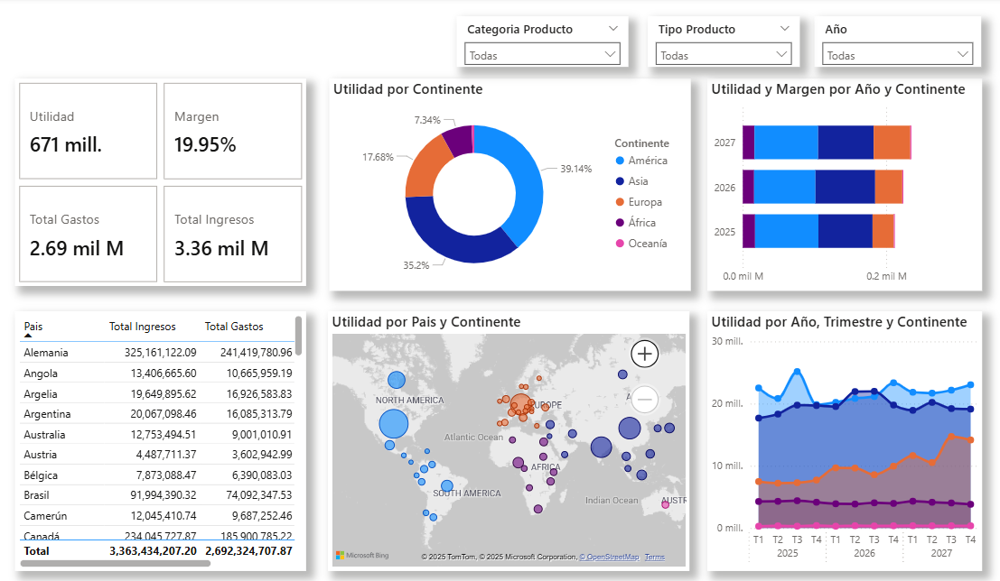

# Applo Dashboard

# 📊 Dashboard de Análisis Financiero de Productos Digitales y Dispositivos

¡Bienvenido/a! Este dashboard interactivo te permite visualizar el desempeño financiero de diversos productos tecnológicos, analizando ingresos, gastos, márgenes y utilidad por categoría, región y período de tiempo.

## 📌 Contenido
- **`ApploBi.pbix`**: Archivo de Power BI que contiene:
  - Tarjetas con métricas clave
  - Gráfico de anillo para distribución
  - Barras apiladas por categoría
  - Gráfico de líneas temporal
  - Mapa interactivo por continente/país
  - Tablas detalladas
- **`Applo Datos.xlsx`**: Base de datos con:
  - Tabla principal: Periodo | Tipo Producto | Region | Ingresos | Gastos
  - Tabla de productos: Tipo Producto | Categoria Producto

## 🚀 Cómo usar
1. Descarga los archivos `ApploBi.pbix` y `Applo Datos.xlsx`
2. Abre el dashboard en [Power BI Desktop](https://powerbi.microsoft.com/es-es/desktop/)
3. Utiliza los filtros interactivos para:
   - Seleccionar por categoría (digital/dispositivo)
   - Filtrar por tipo de producto (celulares, TV, tablets, etc.)
   - Analizar por año o período
4. Explora las visualizaciones para identificar tendencias

## 🔍 Detalles técnicos
- **Fuente de datos**: Dataset obtenido de fuentes web públicas
- **Transformaciones**: Procesamiento y limpieza con Power Query
- **Visualizaciones incluidas**:
  - Tarjetas con KPIs financieros
  - Gráfico de anillo (distribución)
  - Barras apiladas (comparación)
  - Líneas temporales
  - Mapa geográfico
  - Tablas detalladas
- **Objetivo**: Analizar el rendimiento financiero de productos tecnológicos para identificar oportunidades de optimización

## 📸 Vista previa

## 🤝 Contribuciones
Las sugerencias para mejorar este análisis son bienvenidas. Puedes:
- Reportar problemas en [Issues](https://github.com/IamNestor/applo-dashboard/issues)
- Proponer mejoras mediante Pull Requests

---
✨ **Creado por Nestor Emilio Parra Rivas**  
[LinkedIn](https://www.linkedin.com/in/nestor-emilio-parra-rivas-7b6593307/) | [GitHub](https://github.com/IamNestor)